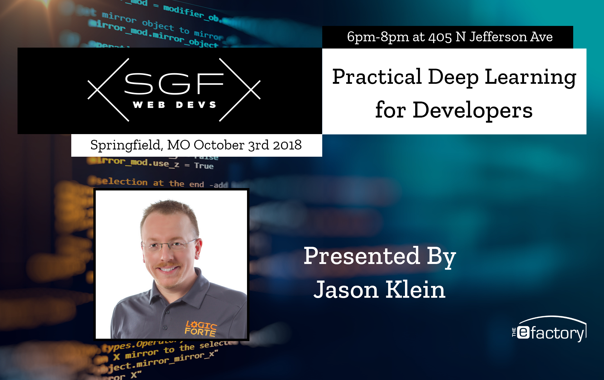

# Practical Deep Learning for Developers

### Summary

This discussion of available Deep Learning APIs from various cloud
services included demonstrations of numerous AWS deep learning services
through the AWS console and the enclosed Python Code Samples.

### Introduction

Deep Learning is more accessible than ever, but most developers have not
had an opportunity to use this technology first-hand. **Jason Klein**
with **Logic Forte** will cover practical examples to use Deep Learning
services and models that you can integrate into your applications.

Jason demonstrates how to use existing cloud APIs to access existing
Deep Learning models (e.g. analyze/identify photos and videos,
language processing and sentiment analysis, build chatbots that respond
to text or audio questions, convert text to lifelike speech, convert
speech or voicemail to text, and translate text to/from any language).

Jason has published the code examples that were shared during his
presentation. Although the API examples are specific to AWS, Google,
Microsoft, and IBM provide similar APIs. Refer to the table below for
links to equivalent Deep Learning services from the other providers.

### Presentation

We discussed the following topics.
View the [Presentation Slides](presentation-slides.pdf) for more details.

* Welcome
* Overview
* Image Recognition
* Video Analysis
* Natural Language Processing
* Conversational Interfaces
* Text to Speech, Speech to Text
* Language Translation

### Services by Cloud Provider

Although we explored Deep Learning Models provided as services from
Amazon Web Services (AWS), similar services are available through the
various cloud hosting providers.

I also included several services only available on other platforms,
such as Voice Verification, Spell Check, and Time Correlation. If a
provider does not already offer a pre-trained Deep Learning model that
meets your needs, explore the Machine Learning services provided by
each platform.

Service | Amazon | Google | Microsoft | IBM
------- | ------ | ------ | --------- | ---
Image Recognition | [Rekognition](https://aws.amazon.com/rekognition/) | [Vision](https://cloud.google.com/vision/) | [Vision](https://azure.microsoft.com/en-us/services/cognitive-services/computer-vision/), [Face](https://azure.microsoft.com/en-us/services/cognitive-services/face/), [Moderator](https://azure.microsoft.com/en-us/services/cognitive-services/content-moderator/) | [Visual](https://www.ibm.com/watson/services/visual-recognition/)
Video Analysis | [Rekognition](https://aws.amazon.com/rekognition/) | [Video Intelligence](https://cloud.google.com/video-intelligence/) | [Video](https://azure.microsoft.com/en-us/services/media-services/video-indexer/), [Moderator](https://azure.microsoft.com/en-us/services/cognitive-services/content-moderator/) | [Captioning](https://www.ibm.com/watson/media/watson-captioning/), [Enrichment](https://www.ibm.com/watson/media/watson-video-enrichment/)
Natural Language Processing | [Comprehend](https://aws.amazon.com/comprehend/) | [Natural Language](https://cloud.google.com/natural-language/) | [Text Analyitcs](https://azure.microsoft.com/en-us/services/cognitive-services/text-analytics/), [Language Understanding](https://azure.microsoft.com/en-us/services/cognitive-services/language-understanding-intelligent-service/), [QnA Maker](https://azure.microsoft.com/en-us/services/cognitive-services/directory/know/), [Moderator](https://azure.microsoft.com/en-us/services/cognitive-services/content-moderator/) | [Classify](https://www.ibm.com/watson/services/natural-language-classifier/), [Understanding](https://www.ibm.com/watson/services/natural-language-understanding/), [Discovery](https://www.ibm.com/watson/services/discovery/), [Tone](https://www.ibm.com/watson/services/tone-analyzer/), [Personality](https://www.ibm.com/watson/services/personality-insights/), [News](https://www.ibm.com/watson/services/discovery-news/)
Conversational Interfaces | [Lex](https://aws.amazon.com/lex/) | [Dialogflow](https://dialogflow.com/) | [Bot Service](https://azure.microsoft.com/en-us/services/bot-service/) | [Assistant](https://www.ibm.com/watson/services/conversation/), [Voice Agent](https://console.bluemix.net/catalog/services/voice-agent-with-watson)
Text to Speech | [Polly](https://aws.amazon.com/polly/) | [Text to Speech](https://cloud.google.com/text-to-speech/) | [Text to Speech](https://azure.microsoft.com/en-us/services/cognitive-services/text-to-speech/) | [Text to Speech](https://www.ibm.com/watson/services/text-to-speech/)
Speech to Text | [Transcribe](https://aws.amazon.com/transcribe/) | [Speech to Text](https://cloud.google.com/speech-to-text/) | [Speech to Text](https://azure.microsoft.com/en-us/services/cognitive-services/speech-to-text/) | [Speech to Text](https://www.ibm.com/watson/services/speech-to-text/)
Language Translation | [Translate](https://aws.amazon.com/translate/) | [Translation](https://cloud.google.com/translate/) | [Translation](https://azure.microsoft.com/en-us/services/cognitive-services/speech-translation/) | [Translator](https://www.ibm.com/watson/services/language-translator/)
Voice Verification | N/A | N/A | [Verification](https://azure.microsoft.com/en-us/services/cognitive-services/speaker-recognition/) | N/A
Spell Check | N/A | N/A | [Spell Check](https://azure.microsoft.com/en-us/services/cognitive-services/spell-check/) | N/A
Time Series Correlation | N/A | [Inference](https://cloud.google.com/inference/) | [Insights](https://azure.microsoft.com/en-us/services/time-series-insights/) | N/A
Machine Learning | [SageMaker](https://aws.amazon.com/sagemaker/) | [AutoML](https://cloud.google.com/automl/) | [Machine Learning](https://azure.microsoft.com/en-us/overview/machine-learning/) | [Machine Learning](https://www.ibm.com/cloud/machine-learning)

*Updated 10/04/2018*

### Event Details

Presented by [Jason Klein](https://jrklein.com/)
([Logic Forte](https://logicforte.com/))
to [Springfield Web Developers](http://sgfwebdevs.com/)
on Wednesday October 3rd, 2018
at [The eFactory](https://efactory.missouristate.edu/) in Springfield Missouri

### Reference

* Event Page (https://www.meetup.com/SGF-Web-Devs/events/251077263/)
* Event Recording (https://www.youtube.com/watch?v=SwkFlD_Zb3U)
